# Parte 1: Bases de Datos

## 1. ¿Qué tipo de base de datos es? Clasificarla según estructura y función.

La base de datos presentada para este trabajo corresponde a una BD **relacional** (SQL) según su estructura y una BD **transaccional** según su función. Para proveer un poco más de contexto, una base de datos que corresponde al modelo relacional organiza los datos en tablas relacionadas mediante claves primarias y foráneas, y usa el lenguaje SQL para gestionar y manipular la información a través de transacciones (he aquí su función como BD transaccional). Tiene una estructura lógica en tablas, provee integridad de los datos mediante restricciones, y la capacidad de realizar consultas eficientes. Además, sigue las propiedades ACID (Atomicidad, Consistencia, Aislamiento y Durabilidad), garantizando que las transacciones sean seguras, coherentes y recuperables. Esto la hace ideal para manejar grandes volúmenes de datos con relaciones complejas, asegurando su integridad y accesibilidad. 

## 2. Armar el diagrama entidad-relación de la base de datos dada.

Para armar el diagrama entidad-relación identificamos aquella información de la base de datos:

- **Pacientes:** Representa a los pacientes con detalles como nombre, fecha de nacimiento, dirección, ciudad y un identificador de sexo biológico. Su PK es id_paciente y su FK id_sexo, referente a la tabla SexoBiológico.
- **SexoBiologico:** Contiene los posibles valores de sexo biológico para los pacientes. Su PK es id_sexo.
- **Especialidades:** Contiene la lista de especialidades médicas. Su PK es id_especialidad.
- **Médicos:** Representa a los médicos con información como nombre, teléfono, email, matrícula y una especialidad. Su PK es id_medico y su FK es especialidad_id, referente a la tabla Especialidades.
- **Consultas:** Almacena la información de las consultas entre un médico y un paciente, incluyendo diagnóstico, tratamiento y un código SNOMED. Su PK es id_consulta y sus FK son dos: id_paciente, para la tabla Pacientes y id_medico para la tabla Médicos.
- **Medicamentos:** Lista de los medicamentos disponibles. Su PK es id_medicamento.
- **Recetas:** Almacena las prescripciones médicas, asociando un medicamento a un paciente por un médico en una fecha específica. Su PK es id_receta y sus 3 FK son id_medico (tabla Médicos), id_paciente (tabla Pacientes) y id_medicamento (tabla Medicamentos)

Las relaciones se ven dictadas por las foreign keys que vinculan las distintas tablas. 

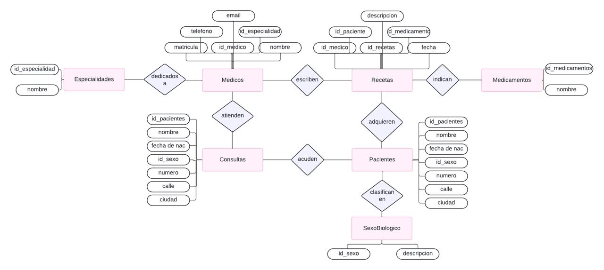

## 3. Armar el Modelo relacional de la base de datos dada.

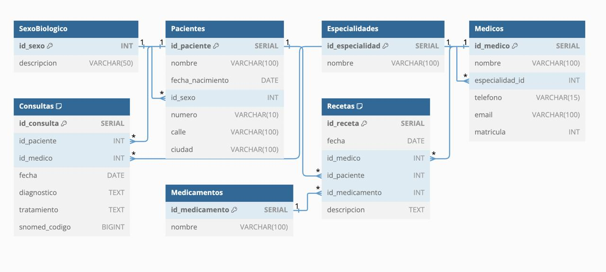

## 4. ¿Considera que la base de datos está normalizada? En caso que no lo esté, ¿cómo podría hacerlo? Nota: no debe normalizar la base de datos, solo explicar como lo haría.

# Parte 2: SQL

## 1. Cuando se realizan consultas sobre la tabla paciente agrupando por ciudad los tiempos de respuesta son demasiado largos. Proponer mediante una query SQL una solución a este problema.

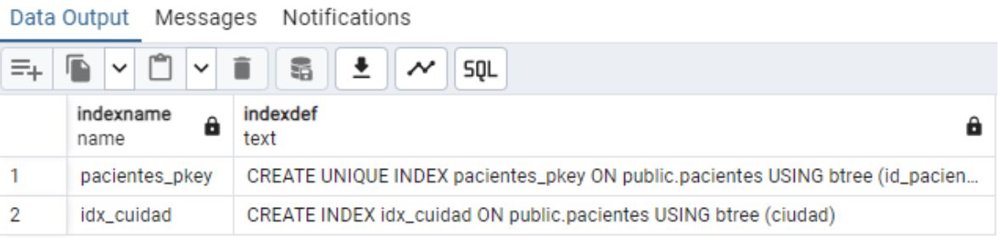

## 2. Se tiene la fecha de nacimiento de los pacientes. Se desea calcular la edad de los pacientes y almacenarla de forma dinámica en el sistema ya que es un valor típicamente consultado, junto con otra información relevante del paciente.

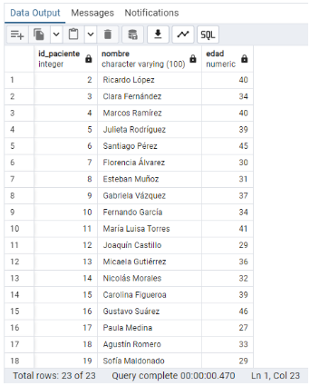
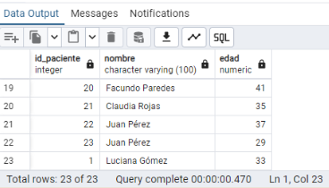

## 3. La paciente, “Luciana Gómez”, ha cambiado de dirección. Antes vivía en “Avenida Las Heras 121” en “Buenos Aires”, pero ahora vive en “Calle Corrientes 500” en “Buenos Aires”. Actualizar la dirección de este paciente en la base de datos.

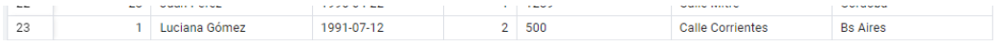

## 4. Seleccionar el nombre y la matrícula de cada médico cuya especialidad sea identificada por el id 4.

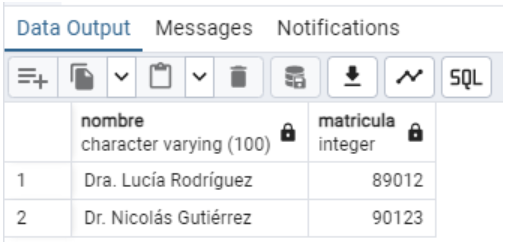

## 5. Puede pasar que haya inconsistencias en la forma en la que están escritos los nombres de las ciudades, ¿cómo se corrige esto? Agregar la query correspondiente.

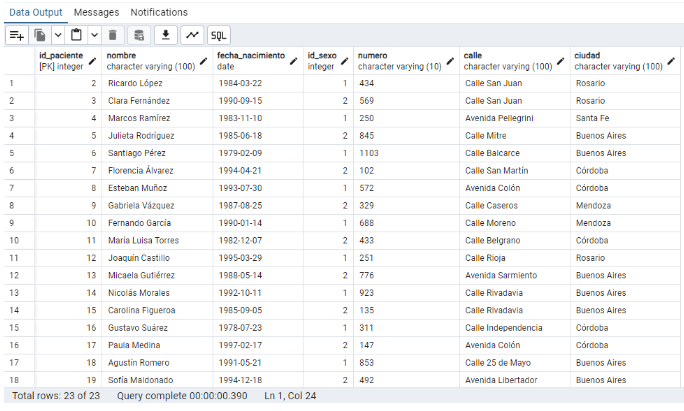
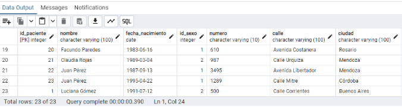

## 6. Obtener el nombre y la dirección de los pacientes que viven en Buenos Aires.

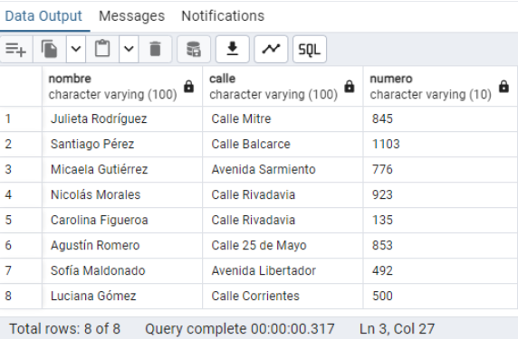

## 7. Cantidad de pacientes que viven en cada ciudad.

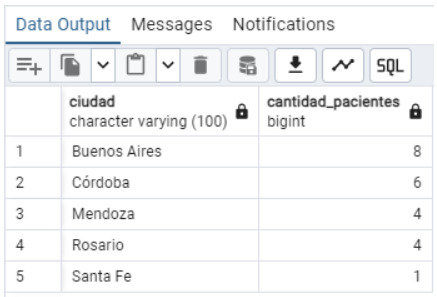

## 8. Cantidad de pacientes por sexo que viven en cada ciudad.

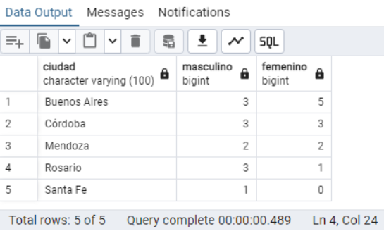

## 9. Obtener la cantidad de recetas emitidas por cada médico.

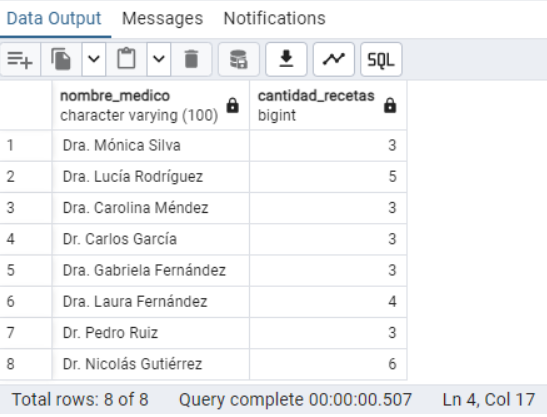

## 10. Obtener todas las consultas médicas realizadas por el médico con ID igual a 3 durante el mes de agosto de 2024.

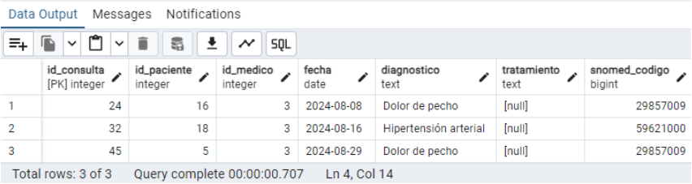

## 11. Obtener el nombre de los pacientes junto con la fecha y el diagnóstico de todas las consultas médicas realizadas en agosto del 2024.

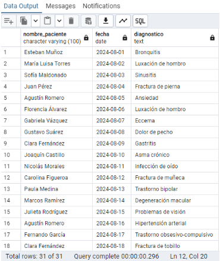
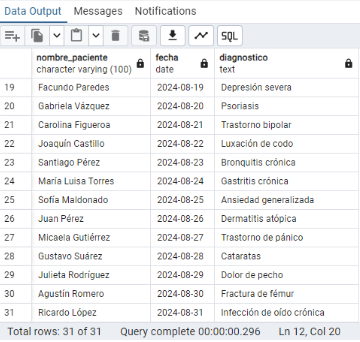

## 12. Obtener el nombre de los medicamentos prescritos más de una vez por el médico con ID igual a 2.

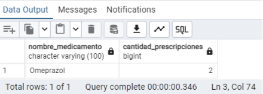

## 13. Obtener el nombre de los pacientes junto con la cantidad total de recetas que han recibido.

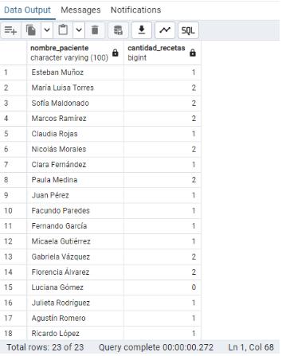
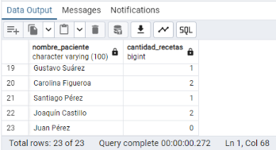

## 14. Obtener el nombre del medicamento más recetado junto con la cantidad de recetas emitidas para ese medicamento.

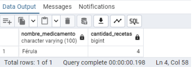

## 15. Obtener el nombre del paciente junto con la fecha de su última consulta y el diagnóstico asociado.

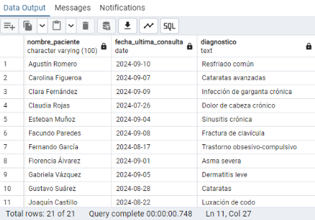
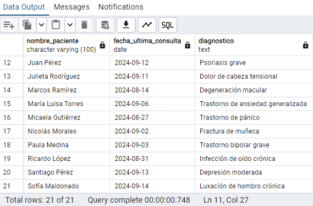

## 16. Obtener el nombre del médico junto con el nombre del paciente y el número total de consultas realizadas por cada médico para cada paciente, ordenado por médico y paciente.

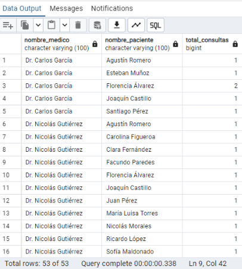
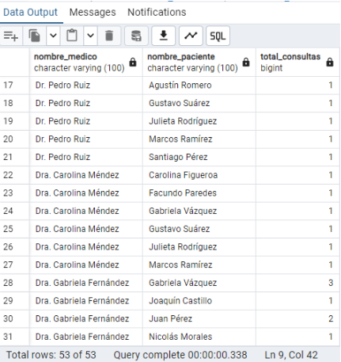
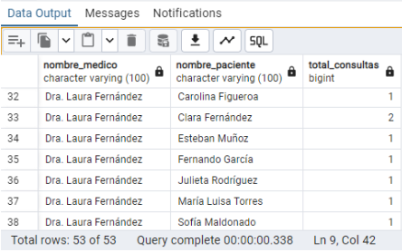
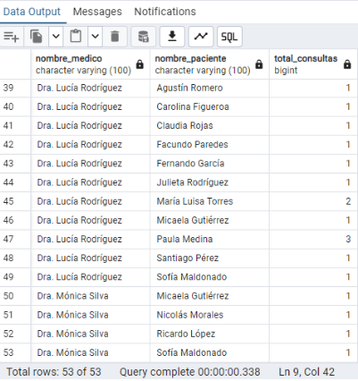

## 17. Obtener el nombre del medicamento junto con el total de recetas prescritas para ese medicamento, el nombre del médico que lo recetó y el nombre del paciente al que se le recetó, ordenado por total de recetas en orden descendente.

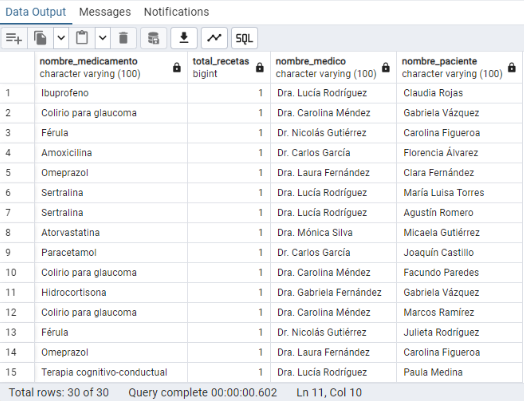
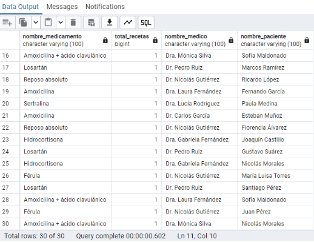

## 18. Obtener el nombre del médico junto con el total de pacientes a los que ha atendido, ordenado por el total de pacientes en orden descendente.

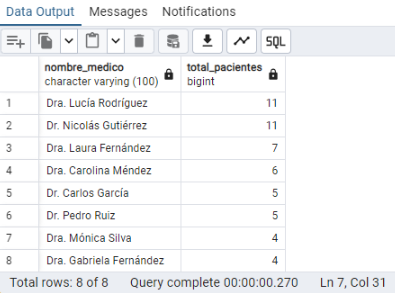

